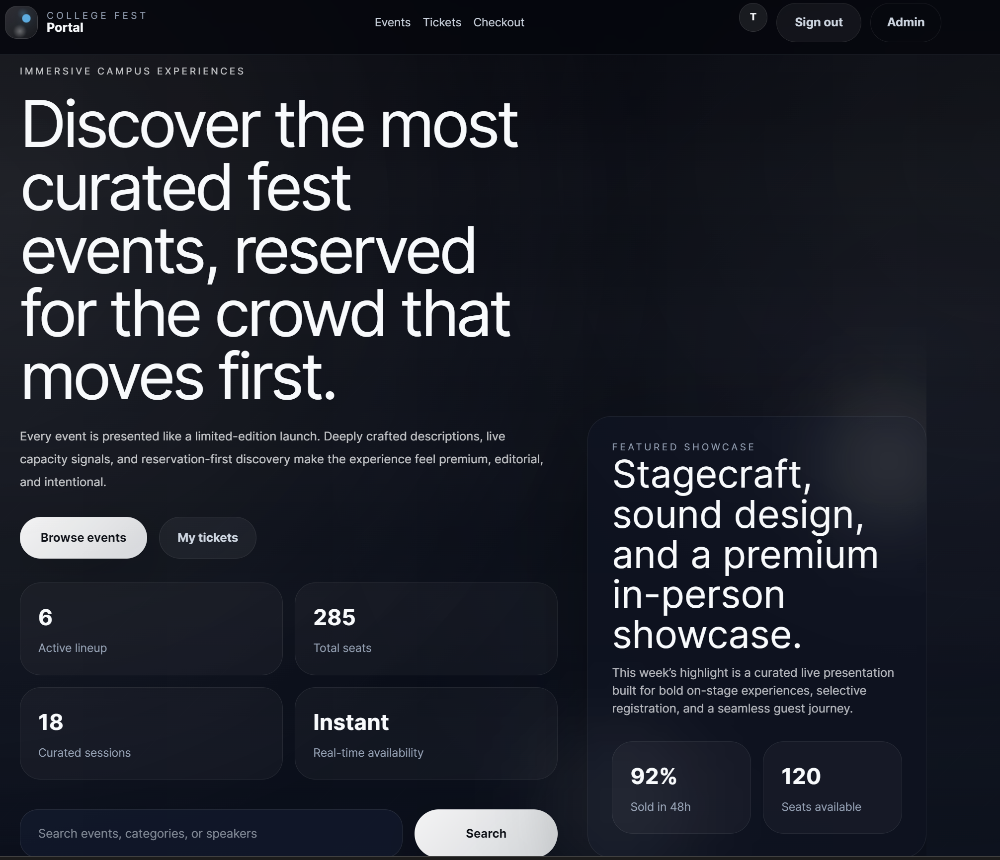

# CC Fest Portal

<p>
  
</p>

<p>
  A server-rendered full-stack event registration portal built with FastAPI, SQLite, Jinja2, and Tailwind CSS as part of a Cloud Computing lab assignment.
</p>

<p>
  
  
  
  
</p>

---

## Overview

CC Fest Portal is a lightweight web application designed to simulate the workflow of a college fest registration system.

The application allows users to create accounts, browse events, reserve seats, and manage registrations through a clean server-rendered interface. The primary goal of this lab assignment was to explore backend architecture, session handling, database operations, and containerized deployment using FastAPI.

Rather than focusing on building a large-scale production platform, the emphasis was placed on learning how different parts of a web application connect together in a structured way.

---

## Features

- User registration and login
- Session-based authentication
- Event browsing and search
- Seat reservation system
- Capacity tracking for events
- QR ticket generation
- Admin login and event management
- Responsive dark-themed UI
- SQLite database integration
- Docker support for deployment

---

## Tech Stack

| Layer            | Technology            |
| ---------------- | --------------------- |
| Backend          | FastAPI               |
| Frontend         | Jinja2 + Tailwind CSS |
| Database         | SQLite                |
| Authentication   | Session Cookies       |
| Server           | Uvicorn               |
| Containerization | Docker                |

---

## Folder Structure

```bash id="bc0i2f"
CC_Fest_Portal/
│
├── static/                # CSS and frontend assets
├── templates/             # HTML templates
├── main.py                # Main FastAPI application
├── database.py            # Database configuration
├── seed.py                # Seed sample events
├── insert_events.py       # Event insertion utility
├── requirements.txt
├── Dockerfile
├── docker-compose.yml
└── README.md
```

---

## Running Locally

### Clone the repository

```bash id="mxj3aa"
git clone <your-repo-url>
cd CC_Fest_Portal
```

### Create a virtual environment

```bash id="cz2dj6"
python -m venv .venv
```

### Activate the environment

#### Windows

```bash id="4qwdyn"
.venv\Scripts\activate
```

#### macOS / Linux

```bash id="x1fb3m"
source .venv/bin/activate
```

### Install dependencies

```bash id="a9ibhu"
pip install -r requirements.txt
```

### Seed the database

```bash id="wtc8ik"
python seed.py
```

### Start the application

```bash id="5v3d9k"
uvicorn main:app --reload
```

Open the browser at:

```text id="q4qb22"
http://127.0.0.1:8000
```

---

## Demo Credentials

```text id="lh1s9w"
Username: tester
Password: tester123
```

---

## Docker Setup

Run the application using Docker:

```bash id="6o4gqm"
docker compose up --build
```

---

## Application Flow

- Users can create an account or log in
- Events are displayed with seat availability
- Users can reserve seats for available events
- Registrations are linked to the logged-in account
- Admin routes allow event monitoring and management
- QR-based tickets are generated after registration

---

## Future Improvements

- Email verification
- Better mobile responsiveness
- Event categories and filters
- PostgreSQL integration
- Real-time seat updates
- Payment gateway simulation

---

## Academic Context

This application was developed as part of a Cloud Computing laboratory assignment for exploring backend systems, deployment workflows, and full-stack web application fundamentals.

---
